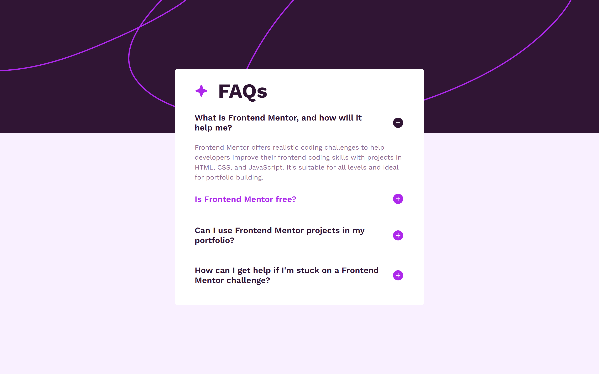

# Frontend Mentor - FAQ accordion solution

This is a solution to the [FAQ accordion challenge on Frontend Mentor](https://www.frontendmentor.io/challenges/faq-accordion-wyfFdeBwBz). Frontend Mentor challenges help you improve your coding skills by building realistic projects. 

## Table of contents

- [Overview](#overview)
  - [The challenge](#the-challenge)
  - [Screenshot](#screenshot)
  - [Links](#links)
- [My process](#my-process)
  - [Built with](#built-with)
  - [What I learned](#what-i-learned)
  - [Continued development](#continued-development)
  - [Useful resources](#useful-resources)
- [Author](#author)
- [Acknowledgments](#acknowledgments)

## Overview

### The challenge

Users should be able to:

- Hide/Show the answer to a question when the question is clicked
- Navigate the questions and hide/show answers using keyboard navigation alone
- View the optimal layout for the interface depending on their device's screen size
- See hover and focus states for all interactive elements on the page

### Screenshot

### Links

- Solution URL: [My solution URL](https://github.com/Ghozy165/FAQ-accordion)
- Live Site URL: [My live site URL](https://faq-accordion-gold-ten.vercel.app)

## My process

### Built with

- Semantic HTML5 markup
- CSS custom properties
- Flexbox
- Mobile-first workflow

### What I learned

- aria-label and Aria-hidden for accessibility
- JS DOM Manipulation for changing element in HTML
- addEventListener to detect events that occur on the page
- Make reuseable code

### Continued development

- make HTML keep code semantic and accessible
- make JS code reuseable and readable

### Useful resources

- [HTML Cheat sheet](https://htmlcheatsheet.com/) - Provide HTML CSS JS summary

## Author

- Frontend Mentor - [@Ghozy165](https://www.frontendmentor.io/profile/Ghozy165)

## Acknowledgments

Thanks a lot to Frontend Mentor for the inspiration and help they provide